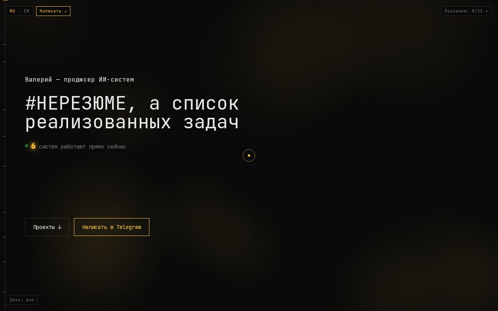

# Портфолио Валерия — игры, боты и автоматизация

[Открыть сайт](http://vanatat.ru/)

Тёмный интерфейс с интерактивными демонстрациями, анимацией и терминальными
элементами. Можно открыть игры, посмотреть показания домашнего датчика воздуха
и познакомиться с системами автоматизации. Техническое имя — `lending2`.




*Локальный запуск сборки, 28 сентября 2026.*

## Данные на странице

| Блок | Источник | При отсутствии связи |
|---|---|---|
| HP100 | Публичный [GitHub JSON-фид](https://github.com/Fanatat/hp100-live-feed) | Предусмотрен демонстрационный источник; проверяйте индикатор состояния |
| Портфель | Сгенерированные демонстрационные значения | Не отражает реальный счёт |
| Игры и системы | Демонстрации и ссылки на отдельные сборки | Доступность внешних страниц проверяется отдельно |

Скрипт фида опрашивает сервер с целевой паузой около пяти минут, браузер запрашивает
фид примерно раз в минуту. Это последние опубликованные данные с возможной задержкой.

## Разработка

Node.js 22 (версия CI), npm и Git:

```bash
git clone https://github.com/Fanatat/lending2.git
cd lending2
npm ci
# Необязательно: cp .env.local.example .env.local
npm run dev
```

Откройте http://localhost:3000. Стек: Next.js 14, React, TypeScript, Tailwind CSS,
Three.js, Framer Motion и Lenis.

## Сборка и проверки

```bash
npm run lint
npm run typecheck
npm run build
npm run start
```

Для проверки в браузере установите Chromium командой `npx playwright install chromium`.
При работающем сайте выполните в другом терминале:

```bash
SMOKE_BASE_URL=http://localhost:3000 npm run smoke
```

Smoke-проверка читает sitemap и открывает страницы, проверяя HTTP-ответы и ошибки
консоли. Внешние ресурсы требуют сети.

Статический экспорт для GitHub Pages:

```bash
PAGES_BASE_PATH=/lending2 npm run build
```

Результат — `out/`; [workflow Pages](.github/workflows/pages.yml) публикует его.
Обычная сборка запускается Node.js-сервером через `npm run start`.
Хостинг основного домена настраивается отдельно от Pages.

На 28 сентября 2026 HTTP-адрес доступен, но HTTPS-сертификат не соответствует
имени vanatat.ru. Canonical, sitemap и OG рассчитаны на HTTPS: перед окончательным
переходом ссылок нужно исправить сертификат на стороне хостинга и перепроверить его.

## Карта файлов

- [app/](app/) — страницы и метаданные.
- [components/](components/) — интерфейс и интерактивные демонстрации.
- [lib/](lib/) — данные, адреса и логика.
- [public/](public/) — ресурсы.
- [scripts/smoke.mjs](scripts/smoke.mjs) — проверка страниц в браузере.

## Площадки игр

Все пять игр опубликованы в VK; в Яндекс Играх и CrazyGames пока не опубликованы.
Статус подтверждён владельцем 28 сентября 2026.
